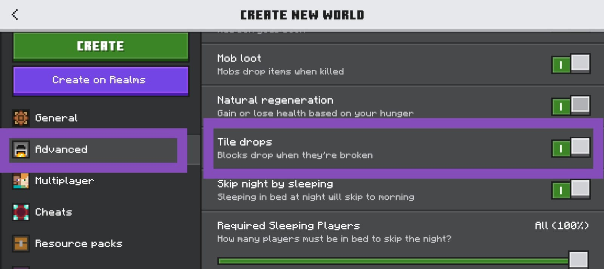

# 🌌 **AnarchyArray**

> [!NOTE]  
> 💡 Original concept credited and thanks to [Max‑RM](https://github.com/Max-RM), who first discovered this on Windows. 
> 📝 The Android signatures were later found by me

> [!CAUTION]  
> ⚠️ **ENTER AT YOUR OWN RISK — these modules are chaos engines.**  
>  
> 🚫 Do **NOT** load survival saves, long‑term builds, or worlds you care about.  
> 🔥 These mechanics are instant, global, and irreversible.  
> 📈 Playing with them will **massively increase world size**.  
> 🧨 Expect terrain collapse, fluid chaos, and total instability.  
>  
> 👉 Use **only** in disposable test worlds. Embrace the destruction.

> [!WARNING]  
> ⚠️ **Disable tile drops** — otherwise performance will nosedive into unplayable lag.

---
👇 Disable it like this.
---

---
⚡ Now it won't lag because of that popping out leaf litter and kelp.

## ✨ Features (once activated)

- 🌊 **InfinitySpread**  
  One block of water or lava becomes an endless flood or eruption.  

- 🧽 **SpongeRange+**  
  Sponges absorb far beyond their normal radius, wiping huge areas clean in seconds.  

- 🧽 **SpongeRange++**  
  If your device survived SpongeRange+, push it further — near-total wipe potential.  

- 🔄 **AbsorbType for Sponge**  
  Sponges don’t just soak water; they’ll consume lava, blocks, and more depending on config.  

## 📖 Known AbsorbTypes

- 0 = air
- 1 = dirt
- 2 = wood
- 3 = block of iron, gold, redstone, emerald, diamond, netherite and coppper & its product (excluding copper grates and lapis), etc
- 4 = copper grates
- 5 = water (default)
- 6 = lava (sponges don't work in the nether)
- 7 = leaves
- 8 = flowers, leaf litter, kelp, etc, plants
- 9 = azalea, dried kelp, etc, solid plants
- 10 = fire, soul fire
- 11 = glass
- 12 = tnt
- 13 = ice (NOT blue or packed ice)
- 14 = powdered snow
- 15 = cactus
- 16 = portal, end portal, end gateway portal
- 17 = unknown
- 18 = bubble column
- 19 = unknown
- 20 = decorated pot, decoration solids
- 21 = n/a
- 22 = structure void
- 23 = sand, stone, deeplate, etc, solids
- 24 = torches, scaffolding, pot, non-solids
- 25 = unknown

## ⚙️ Requirements

- 🚀 [LeviLauncher](https://github.com/LiteLDev/LeviLaunchroid)

## 🛠️ Installation

- Install LeviLauncher
- Import AnarchyArray mod in LeviLauncher by doing "Manage Mods > Add Mod"
- Launch Minecraft with the mod activated

## 📜 License
- This project is licensed under the GNU LGPL v3.0.  
- It also uses third-party libraries (ImGui, fmtlib) licensed under the MIT License.  
- See the NOTICE file for details.

